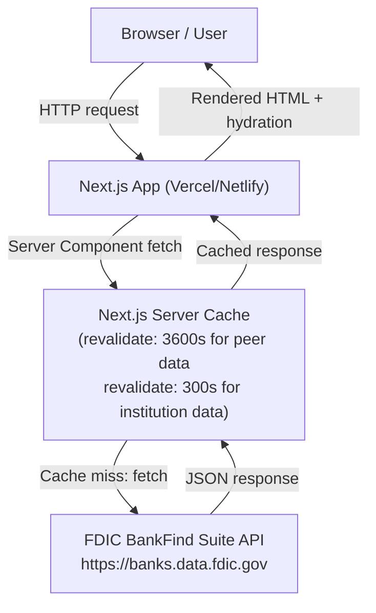

# Design Document: Bank Safety Tool

## FDIC API Validation — TBD Items Resolved

Before making design decisions, the three TBD items from requirements were validated against the live FDIC BankFind Suite API (`https://banks.data.fdic.gov`). Results follow.

### TBD 1: Insured vs. Uninsured Deposit Segmentation

**Validated: Both series are available per institution per quarter.**

The `/financials` endpoint returns:
- `DEP` — total deposits (thousands)
- `DEPINS` — estimated insured deposits (thousands)
- `DEPNIDOM` — uninsured domestic deposits (thousands)
- `DEPFOR` — foreign deposits (thousands)

Sample response for CERT 3511 (Wells Fargo), Q4 2025:
```json
{ "DEP": 1483390000, "DEPINS": 821222000, "DEPNIDOM": 404901000 }
```

**Design decision:** Surface both total deposits and insured/uninsured segmentation in the Deposit Trend card. Requirement 10 SHOULD is upgraded to SHALL for the segmented series display, as the data is confirmed available. The Uninsured Deposit Concentration card (Req 9) uses `DEPNIDOM / DEP` as the concentration ratio.

**Note on uninsured calculation:** `DEPNIDOM` covers uninsured domestic deposits. Foreign deposits (`DEPFOR`) are separately tracked and are not FDIC-insured. The displayed uninsured concentration metric will be `(DEPNIDOM + DEPFOR) / DEP` to capture the full uninsured exposure, with a tooltip explaining the components.

---

### TBD 2: Enforcement Action Response Shape

**Finding: No dedicated enforcement actions endpoint exists in the FDIC BankFind Suite public API.**

Exhaustive endpoint probing confirmed:
- `/api/enforcements` — 404 Not Found
- `/api/enforcement` — 404 Not Found
- Institution fields `ENFFLAG`, `ENFTYP`, `ENFDATE` — not present in the institutions index
- The `/api/failures` endpoint covers bank failures/receiverships only, not active enforcement actions

The FDIC publishes enforcement actions on a separate web portal (`https://www.fdic.gov/bank/individual/enforcement/`) but this is not queryable via the BankFind Suite API.

**Design decision:** Per Requirement 11's fallback clause, the Regulatory Status card SHALL display a notice directing the user to check the FDIC's enforcement actions page directly, with a deep link to `https://www.fdic.gov/bank/individual/enforcement/` pre-filtered by institution name where possible. The card will not attempt to parse the enforcement actions web page. This is a known limitation and will be documented on the Methodology Page.

**Exception — bank failures:** The `/api/failures` endpoint IS queryable by CERT and returns `RESTYPE`, `FAILDATE`, `RESTYPE1`, and `BIDNAME` (acquiring institution). This data will be used to surface receivership status as a special case of the Regulatory Status card.

---

### TBD 3: Peer Comparison Cohort Definition

**Validated: The FDIC API exposes a native peer group definition via the `SPECGRP` / `SPECGRPN` fields on the `/institutions` endpoint.**

The complete SPECGRP taxonomy (confirmed via API):

| SPECGRP | SPECGRPN | Active Count |
|---------|----------|-------------|
| 1 | International Specialization | ~4 |
| 2 | Agricultural Specialization | ~1,400 |
| 3 | Credit-card Specialization | ~10 |
| 4 | Commercial Lending Specialization | ~2,387 |
| 5 | Mortgage Lending Specialization | ~small |
| 6 | Consumer Lending Specialization | ~36 |
| 7 | Other Specialized Under 1 Billion | ~350+ |
| 8 | All Other Under 1 Billion | ~350 |
| 9 | All Other Over 1 Billion | ~82 |

`SPECGRP` is also filterable on the `/financials` endpoint, enabling peer group financial data retrieval in a single query.

**Design decision:** Use FDIC-native `SPECGRP` as the peer group definition. This is the same peer grouping the FDIC itself uses in its Uniform Bank Performance Report (UBPR). No proprietary cohort construction is needed. Peer median is computed client-side from the most recent quarter's data for all active institutions in the same SPECGRP.

**Peer data fetch strategy:** Fetch all active institutions in the same SPECGRP for the most recent quarter from `/financials`. Cache this peer dataset aggressively (TTL: 24 hours) since it changes only quarterly.

---

## Overview

The Bank Safety Tool is a single-page web application that lets consumers look up any FDIC-insured bank and see a plain-English read on its financial health. The application fetches data exclusively from the FDIC BankFind Suite public API, computes derived metrics client-side, and renders seven financial health indicator cards alongside a regulatory capital categorization.

The tool is a take-home assessment deliverable. The stack must be lean, demonstrable locally, and deployable to Vercel or Netlify with zero backend infrastructure.

### Recommended Tech Stack

**Framework: Next.js 14 (App Router) with TypeScript**

Rationale:
- Next.js provides file-based routing, server components for initial data fetching, and built-in API routes — all without a separate backend
- The App Router's `fetch` with `next: { revalidate }` gives us server-side caching of FDIC API responses with zero additional infrastructure, directly solving the rate-limit and demo-reliability concerns
- TypeScript catches field-mapping bugs early — critical for a financial data tool where a wrong field name silently returns `undefined`
- Deploys to Vercel in one command; Netlify support via `@netlify/plugin-nextjs`
- Widely understood, easy to demo and explain

**Styling: Tailwind CSS**

Rationale: Utility-first CSS enables rapid, consistent mobile-first layouts without a separate design system. The responsive grid for indicator cards is straightforward with Tailwind's `grid-cols` utilities.

**Charting: Recharts**

Rationale: React-native, lightweight, accessible (SVG-based with ARIA support), and well-suited for the simple line/bar charts needed for trend visualizations. No canvas dependency.

**Testing: Vitest + React Testing Library + fast-check**

Rationale: Vitest is the standard test runner for Vite-based and Next.js projects. React Testing Library for component tests. fast-check for property-based tests (TypeScript-native, actively maintained).

**Package manager: npm** (matches Node.js runtime, no additional tooling needed)

---

## Architecture



### Data Flow

1. User enters a search query on the home page
2. The search input calls a Next.js Route Handler (`/api/search`) which proxies to the FDIC `/institutions` endpoint with server-side caching
3. User selects an institution; the app navigates to `/bank/[cert]`
4. The `[cert]` page is a Server Component that fetches institution profile, 8 quarters of financials, peer group financials, and failure status in parallel
5. Data is transformed into typed domain models and passed to Client Components for rendering
6. Indicator cards render with Recharts trend visualizations
7. All FDIC API calls are routed through Next.js Route Handlers to enable server-side caching and avoid CORS issues

### Caching Strategy

| Data Type | Cache TTL | Rationale |
|-----------|-----------|-----------|
| Institution search results | 5 minutes | Institutions change rarely; acceptable staleness for search |
| Institution profile | 5 minutes | Profile data (name, charter, assets) changes rarely |
| Institution financials (8 quarters) | 5 minutes | Call Report data is quarterly; 5 min is safe |
| Peer group financials | 24 hours | Peer medians change only when new Call Reports are filed |
| Failure/receivership status | 1 hour | Failures are rare but time-sensitive |

Next.js `fetch` with `next: { revalidate: N }` handles this at the server component level. No Redis or external cache needed.

---

## Components and Interfaces

### Page Structure

```
src/
├── app/
│   ├── page.tsx                    # Home page (search)
│   ├── bank/
│   │   └── [cert]/
│   │       └── page.tsx            # Institution detail page (Server Component)
│   ├── methodology/
│   │   └── page.tsx                # Methodology page
│   └── api/
│       ├── search/route.ts         # FDIC /institutions proxy
│       ├── institution/[cert]/route.ts  # FDIC institution + financials proxy
│       └── peers/[specgrp]/route.ts    # FDIC peer group financials proxy
├── components/
│   ├── search/
│   │   ├── SearchInput.tsx         # Search bar with debounce
│   │   └── SearchResults.tsx       # Disambiguation list
│   ├── institution/
│   │   ├── InstitutionHeader.tsx   # Name, charter, assets, cert number
│   │   ├── CapitalCategoryBadge.tsx # Regulatory capital category display
│   │   └── DataFreshnessNotice.tsx # Data-as-of date + lag warning
│   ├── cards/
│   │   ├── IndicatorCard.tsx       # Base card shell (headline, metric, peer, trend, explanation)
│   │   ├── CapitalAdequacyCard.tsx
│   │   ├── AssetQualityCard.tsx
│   │   ├── EarningsCard.tsx
│   │   ├── LiquidityCard.tsx
│   │   ├── UninsuredDepositCard.tsx
│   │   ├── DepositTrendCard.tsx
│   │   └── RegulatoryStatusCard.tsx
│   ├── charts/
│   │   └── TrendChart.tsx          # Recharts line chart wrapper
│   └── ui/
│       ├── LoadingSpinner.tsx
│       ├── ErrorMessage.tsx
│       └── EmptyState.tsx
├── lib/
│   ├── fdic/
│   │   ├── client.ts               # FDIC API fetch wrapper with error handling
│   │   ├── institutions.ts         # /institutions endpoint queries
│   │   ├── financials.ts           # /financials endpoint queries
│   │   └── failures.ts             # /failures endpoint queries
│   ├── metrics/
│   │   ├── capitalAdequacy.ts      # Capital ratio calculations + categorization
│   │   ├── assetQuality.ts         # NPL ratio + charge-off rate calculations
│   │   ├── earnings.ts             # ROA, NIM calculations
│   │   ├── liquidity.ts            # LTD ratio, cash+securities ratio calculations
│   │   ├── deposits.ts             # Uninsured concentration + deposit trend
│   │   └── peers.ts                # Peer median computation
│   └── utils/
│       ├── formatters.ts           # Currency, percentage, date formatters
│       └── dates.ts                # Data freshness calculations
├── types/
│   ├── fdic.ts                     # Raw FDIC API response types
│   └── domain.ts                   # Transformed domain model types
└── tests/
    ├── unit/
    │   └── metrics/                # Pure function unit + property tests
    └── components/                 # React Testing Library component tests
```

### Key Component Interfaces

```typescript
// IndicatorCard base props
interface IndicatorCardProps {
  headline: string;
  metricName: string;
  currentValue: MetricValue | null;
  peerComparison: PeerComparison | null;
  trend: TrendDataPoint[] | null;
  explanation: string;
  dataAsOf: Date | null;
  emptyStateReason?: EmptyStateReason;
  warningLevel?: 'none' | 'caution' | 'warning' | 'critical';
}

// Metric value with display formatting
interface MetricValue {
  raw: number;
  formatted: string;  // e.g., "12.4%"
  label: string;      // e.g., "Tier 1 Capital Ratio"
}

// Peer comparison
interface PeerComparison {
  institutionValue: number;
  peerMedian: number;
  peerGroupName: string;  // e.g., "All Other Under 1 Billion"
  direction: 'above' | 'below' | 'at';
}

// Trend data point
interface TrendDataPoint {
  quarter: string;  // e.g., "Q4 2024"
  value: number;
}

// Empty state reasons
type EmptyStateReason =
  | 'newly_chartered'
  | 'merged'
  | 'in_receivership'
  | 'data_not_reported'
  | 'api_error';
```

---

## Data Models

### FDIC API Field Mappings

#### `/institutions` endpoint — Institution Profile

| FDIC Field | Type | Description | Used For |
|------------|------|-------------|----------|
| `CERT` | number | FDIC certificate number | Primary key |
| `INSTNAME` | string | Legal institution name | Display |
| `CITY` | string | Headquarters city | Display |
| `STALP` | string | State abbreviation | Display |
| `STNAME` | string | State full name | Display |
| `ASSET` | number | Total assets (thousands) | Display |
| `ESTYMD` | string | Establishment date | Year founded |
| `CHRTAGNT` | string | Charter agent (OCC, STATE, OTS) | Charter type display |
| `CLASS` | string | Institution class code | Charter type |
| `ACTIVE` | number | 1=active, 0=inactive | Merger detection |
| `ENDEFYMD` | string | End date (9999=active) | Merger detection |
| `SPECGRP` | number | Peer group code | Peer comparison |
| `SPECGRPN` | string | Peer group name | Peer comparison display |
| `REPDTE` | string | Most recent report date | Data-as-of date |
| `FDICSUPV` | string | FDIC supervisory region | Display |
| `REGAGNT` | string | Primary regulator | Display |
| `NAMEHCR` | string | Holding company name | Display |
| `DENOVO` | string | De novo flag | Newly chartered detection |
| `PROCDATE` | string | Last processed date | Recency check |

#### `/financials` endpoint — Financial Metrics

| FDIC Field | Type | Description | Indicator Card |
|------------|------|-------------|----------------|
| `REPDTE` | string | Report date (YYYYMMDD) | All cards |
| `CERT` | number | FDIC certificate number | All cards |
| `ASSET` | number | Total assets (thousands) | Capital Adequacy |
| `EQ` | number | Total equity capital (thousands) | Capital Adequacy |
| `RBCT1J` | number | Tier 1 capital (thousands) | Capital Adequacy |
| `RBCRWAJ` | number | Total risk-based capital ratio (%) | Capital Adequacy |
| `LNLSNET` | number | Net loans and leases (thousands) | Asset Quality, Liquidity |
| `LNLSNTV` | number | Non-performing loans as % of total loans | Asset Quality |
| `LNLSDEPR` | number | Loan-to-deposit ratio (%) | Liquidity |
| `ROAQ` | number | Return on assets, quarterly annualized (%) | Earnings |
| `NIMY` | number | Net interest margin (%) | Earnings |
| `DEP` | number | Total deposits (thousands) | Liquidity, Deposit Trend |
| `DEPINS` | number | Estimated insured deposits (thousands) | Uninsured Deposit, Deposit Trend |
| `DEPNIDOM` | number | Uninsured domestic deposits (thousands) | Uninsured Deposit, Deposit Trend |
| `DEPFOR` | number | Foreign deposits (thousands) | Uninsured Deposit |
| `SC` | number | Total securities (thousands) | Liquidity |
| `CASH` | number | Cash and due from banks (thousands) | Liquidity |

**Derived metrics (computed client-side):**

| Metric | Formula | Indicator Card |
|--------|---------|----------------|
| Equity-to-assets ratio | `EQ / ASSET * 100` | Capital Adequacy |
| Tier 1 capital ratio | `RBCT1J / (ASSET - SC - CASH) * 100` (approximation) | Capital Adequacy |
| Net charge-off rate | Not directly available as a rate field. Computed as: `(charge-offs - recoveries) / avg_loans * 100`. **Note:** The FDIC API does not expose a pre-computed net charge-off rate field. The raw charge-off and recovery amounts are available in the Call Report data but are not surfaced in the BankFind Suite `/financials` endpoint's queryable fields. **Design decision:** Display `LNLSNTV` (non-performing loans %) as the primary asset quality metric. For the charge-off rate, display "Data not available via API" with a link to the institution's full Call Report on the FDIC website. This is documented as a known limitation. | Asset Quality |
| Uninsured deposit concentration | `(DEPNIDOM + DEPFOR) / DEP * 100` | Uninsured Deposit |
| Cash + securities to assets | `(CASH + SC) / ASSET * 100` | Liquidity |

#### `/failures` endpoint — Failure/Receivership Status

| FDIC Field | Type | Description |
|------------|------|-------------|
| `CERT` | number | FDIC certificate number |
| `NAME` | string | Institution name at failure |
| `FAILDATE` | string | Failure date |
| `RESTYPE` | string | Resolution type (e.g., "FAILURE") |
| `RESTYPE1` | string | Resolution subtype (PA=purchase & assumption, PI=payoff) |
| `BIDNAME` | string | Acquiring institution name |
| `COST` | number | Estimated cost to DIF (thousands) |

### Domain Models (TypeScript)

```typescript
// Transformed institution profile
interface InstitutionProfile {
  cert: number;
  name: string;
  city: string;
  state: string;
  charterType: string;
  totalAssets: number;
  yearFounded: number;
  fdicCertNumber: number;
  primaryRegulator: string;
  holdingCompany: string | null;
  peerGroup: { code: number; name: string };
  dataAsOf: Date;
  status: 'active' | 'merged' | 'in_receivership' | 'inactive';
  mergerInfo?: { acquiringName: string; acquiringCert: number | null; effectiveDate: Date };
  failureInfo?: { failDate: Date; resolutionType: string; acquiringName: string };
  isNewlyChartered: boolean;  // fewer than 4 quarters of data
  hasCharterConversion: boolean;
  isStateChrtered: boolean;
}

// Financial data for one quarter
interface QuarterlyFinancials {
  cert: number;
  reportDate: Date;
  quarter: string;  // "Q4 2024"
  totalAssets: number;
  equity: number;
  tier1Capital: number;
  totalCapitalRatio: number;
  equityToAssetsRatio: number;
  nonPerformingLoansRatio: number;
  loanToDepositRatio: number;
  returnOnAssets: number;
  netInterestMargin: number;
  totalDeposits: number;
  insuredDeposits: number;
  uninsuredDomesticDeposits: number;
  foreignDeposits: number;
  totalSecurities: number;
  cashAndDue: number;
}

// Regulatory capital category
type CapitalCategory =
  | 'well_capitalized'
  | 'adequately_capitalized'
  | 'undercapitalized'
  | 'significantly_undercapitalized'
  | 'critically_undercapitalized';

// Capital categorization result
interface CapitalCategorization {
  category: CapitalCategory;
  tier1Ratio: number;
  totalCapitalRatio: number;
  equityToAssetsRatio: number;
  thresholdsApplied: {
    tier1: { well: number; adequate: number; under: number; significantlyUnder: number };
    total: { well: number; adequate: number; under: number; significantlyUnder: number };
  };
}
```

### Regulatory Capital Categorization Logic

FDIC-defined thresholds (from 12 CFR Part 325):

| Category | Tier 1 Ratio | Total Capital Ratio | Leverage Ratio |
|----------|-------------|---------------------|----------------|
| Well Capitalized | ≥ 8% | ≥ 10% | ≥ 5% |
| Adequately Capitalized | ≥ 6% | ≥ 8% | ≥ 4% |
| Undercapitalized | < 6% | < 8% | < 4% |
| Significantly Undercapitalized | < 4% | < 6% | < 3% |
| Critically Undercapitalized | Tangible equity ≤ 2% of total assets |

The categorization function takes the minimum category across all applicable ratios. The FDIC API provides `RBCRWAJ` (total risk-based capital ratio) and `RBCT1J` (Tier 1 capital in dollars). The leverage ratio is approximated as `EQ / ASSET`. Critically Undercapitalized is approximated as `EQ / ASSET ≤ 2%`.

---

## Correctness Properties

*A property is a characteristic or behavior that should hold true across all valid executions of a system — essentially, a formal statement about what the system should do. Properties serve as the bridge between human-readable specifications and machine-verifiable correctness guarantees.*

### Property 1: Capital Categorization Correctness

*For any* Tier 1 capital ratio and total capital ratio pair, the `categorizeCapital` function SHALL return the FDIC-defined category that corresponds to the most restrictive threshold breached across all applicable ratios.

**Validates: Requirements 3.2**

### Property 2: Capital Categorization Monotonicity

*For any* two institutions A and B where A has strictly higher Tier 1 and total capital ratios than B, the capital category of A SHALL be at least as favorable as the category of B (i.e., the categorization function is monotonically non-decreasing with respect to capital ratios).

**Validates: Requirements 3.2**

### Property 3: No Composite Score in Rendered Output

*For any* institution data object (with any combination of financial metrics), the rendered institution detail page SHALL NOT contain any element with text matching patterns for composite scores, letter grades (A/B/C/D/F), or numerical safety ratings.

**Validates: Requirements 3.5, 4.5**

### Property 4: Seven Cards Always Present in Correct Order

*For any* institution data object (including institutions with missing metrics, newly chartered institutions, and merged institutions), the rendered institution detail page SHALL contain exactly seven indicator card elements in this order: (1) Capital Adequacy, (2) Asset Quality, (3) Earnings, (4) Liquidity, (5) Uninsured Deposit Concentration, (6) Deposit Trend, (7) Regulatory Status.

**Validates: Requirements 4.1, 4.4**

### Property 5: Data-As-Of Date Always Present

*For any* institution data object and any rendered indicator card, the card SHALL contain a data-as-of date element. No metric value SHALL be rendered without an associated date.

**Validates: Requirements 2.2, 12.1, 12.4**

### Property 6: Stale Data Warning Threshold

*For any* data-as-of date that is 120 or more days before the current date, the rendered institution detail page SHALL display a stale data warning. *For any* data-as-of date that is fewer than 120 days before the current date, the stale data warning SHALL NOT be displayed.

**Validates: Requirements 12.3**

### Property 7: Uninsured Deposit Card Has No Trend

*For any* institution data object, the rendered Uninsured Deposit Concentration card SHALL NOT contain a trend chart or time-series visualization element.

**Validates: Requirements 9.4**

### Property 8: Uninsured Deposit Explanation References $250K Limit

*For any* institution data object, the rendered Uninsured Deposit Concentration card's explanation text SHALL contain a reference to the $250,000 FDIC insurance limit.

**Validates: Requirements 9.2**

### Property 9: API Error Handler Returns Non-Empty Response

*For any* HTTP error status code (4xx or 5xx) returned by the FDIC API, the error handler SHALL return a non-null, non-empty user-facing error message. The rendered page SHALL never be blank or show an unhandled exception.

**Validates: Requirements 13.1, 13.5**

### Property 10: Partial Response Preserves Available Metrics

*For any* subset S of financial metric fields that are present in an API response (where S is a proper subset of all expected fields), the rendered indicator cards SHALL display the metrics in S correctly and SHALL display "Data not available" for metrics not in S. No card SHALL be hidden.

**Validates: Requirements 4.4, 13.3**

### Property 11: Methodology Page Accessible from All Pages

*For any* page in the application (home, institution detail, methodology), the rendered HTML SHALL contain a navigation link to the methodology page.

**Validates: Requirements 14.1**

### Property 12: Methodology Page Contains All Seven Indicator Definitions

*For any* render of the methodology page, the page SHALL contain a definition section for each of the seven indicators: Capital Adequacy, Asset Quality, Earnings, Liquidity, Uninsured Deposit Concentration, Deposit Trend, and Regulatory Status.

**Validates: Requirements 14.3**

### Property 13: No Horizontal Overflow at Any Supported Viewport Width

*For any* viewport width W in the range [320, 1440] pixels, the rendered application SHALL have a document body width that does not exceed W (i.e., no horizontal scrollbar is required).

**Validates: Requirements 15.1, 15.6**

### Property 14: Interactive Elements Have Focus Styles

*For any* interactive element (button, link, input) in the rendered application, the element SHALL have a CSS focus style defined that is visually distinct from its default state.

**Validates: Requirements 15.4**

### Property 15: Search Results Contain Required Fields

*For any* non-empty search result set returned by the FDIC `/institutions` endpoint, the rendered disambiguation list SHALL display each institution's name, city, state, asset size, and FDIC certificate number.

**Validates: Requirements 1.4**

### Property 16: Institution Summary Contains All Required Fields

*For any* institution data object, the rendered institution summary header SHALL contain: legal name, headquarters city and state, charter type, total asset size, year founded, and FDIC certificate number.

**Validates: Requirements 2.1**

---

**Property Reflection — Redundancy Check:**

- Properties 3 and 4 are distinct: Property 3 tests for absence of composite scores; Property 4 tests for presence of exactly 7 cards in the correct order. No redundancy.
- Properties 5 and 6 are distinct: Property 5 tests date presence; Property 6 tests the stale-data threshold logic. No redundancy.
- Properties 13 and 15.6 (from requirements) are the same concept — Property 13 covers both. No duplication in the property list.
- Properties 9 and 10 are distinct: Property 9 tests total API failure; Property 10 tests partial response handling. No redundancy.
- Properties 17, 18, and 19 are distinct from all prior properties: 17 tests peer cohort filtering (regression guard); 18 tests Deposit Trend series count (guards the Req 10 SHALL hardening); 19 tests the if-and-only-if condition for the Regulatory Status warning (guards the Req 11 rewrite). No redundancy.

### Property 17: Peer Comparison Uses FDIC SPECGRP Cohort

*For any* institution data object, the peer comparison data displayed in each Indicator Card SHALL be computed exclusively from institutions sharing the same FDIC `SPECGRP` value as the subject institution. The peer dataset SHALL NOT include institutions from a different `SPECGRP` or from a default/fallback cohort.

**Validates: Requirement 8 (Peer Group Definition — TBD resolved)**

### Property 18: Deposit Trend Card Renders Exactly Three Series When Data Is Available

*For any* institution data object where `DEP`, `DEPINS`, and `DEPNIDOM` are all present in the FDIC API response, the rendered Deposit Trend Indicator Card SHALL contain exactly three time-series visualizations: total deposits (`DEP`), insured deposits (`DEPINS`), and uninsured domestic deposits (`DEPNIDOM`). No more, no fewer.

**Validates: Requirement 10 (Deposit Trend — SHOULD upgraded to SHALL)**

### Property 19: Regulatory Status Warning Fires If and Only If /failures Returns a Record

*For any* institution data object, the Regulatory Status Indicator Card SHALL display a warning treatment if and only if the FDIC `/failures` endpoint returns a record for that institution's CERT. The warning treatment SHALL NOT be displayed when: (a) no `/failures` record exists, or (b) enforcement action data is unavailable via the API. Absence of enforcement-action queryability is a transparency disclosure, not a warning signal.

**Validates: Requirements 11.2, 11.5**

---

## Error Handling

### FDIC API Error States

| Condition | Detection | User-Facing Response |
|-----------|-----------|---------------------|
| HTTP 4xx (client error) | Response status | "We couldn't load data for this bank. The FDIC API returned an error. [Retry]" |
| HTTP 5xx (server error) | Response status | "The FDIC data service is temporarily unavailable. [Retry]" |
| Network timeout (>10s) | `AbortController` with 10s timeout | "The request timed out. This is usually temporary — please try again. [Retry]" |
| Partial response (missing fields) | Field presence check on response | Display available metrics; show "Data not available" for missing fields |
| Rate limit (429) | Response status | Retry with exponential backoff (max 3 attempts, 1s/2s/4s delays) before showing error |
| Empty financials array | Array length check | Show "No financial data available for this institution" in each card |

### Empty State Scenarios

Each indicator card handles these empty states independently:

| Scenario | Detection | Card Display |
|----------|-----------|-------------|
| Newly chartered (<4 quarters) | `DENOVO` flag or <4 records in financials | "Limited history — this institution was chartered recently. Showing [N] quarter(s) of available data." |
| Merged institution | `ACTIVE=0` and merger history record | "This institution merged into [Acquiring Bank] on [Date]." with link if cert is resolvable |
| In receivership | Record in `/failures` endpoint | "This institution was closed by regulators on [Date]. It was acquired by [Acquiring Bank]." |
| Data not yet reported | Most recent `REPDTE` > 90 days ago | "Data for the most recent quarter has not yet been reported to the FDIC." |
| API error for specific card | Caught fetch error | "Data not available — [Retry]" |

### Error Message Rules

- Error messages are never stacked. If multiple API calls fail, a single combined message is shown.
- Timeout messages are visually distinct from general API errors (different icon, different copy).
- Loading states use skeleton placeholders (not spinners) for indicator cards to reduce layout shift.
- Retry buttons re-trigger only the failed request, not the entire page load.

---

## Testing Strategy

### Dual Testing Approach

The testing strategy combines unit/property tests for pure logic functions and component tests for rendering behavior.

**Unit + Property Tests (Vitest + fast-check)**

Target: Pure functions in `src/lib/metrics/` and `src/lib/fdic/`

- `capitalAdequacy.ts` — `categorizeCapital()` function: property tests for correctness and monotonicity (Properties 1, 2)
- `deposits.ts` — `computeUninsuredConcentration()`: property test for ratio bounds [0, 100]
- `dates.ts` — `isStaleData()`: property test for 120-day threshold (Property 6)
- `client.ts` — error handler: property test for non-empty response on any 4xx/5xx (Property 9)
- `metrics/peers.ts` — `computePeerMedian()`: property test that median is always within [min, max] of the peer dataset

**Component Tests (Vitest + React Testing Library)**

Target: Indicator card components and page-level rendering

- `IndicatorCard` — property test: for any props combination, card renders without crashing and contains required elements (Properties 4, 5)
- `UninsuredDepositCard` — property test: no trend element present (Property 7); explanation contains "$250,000" (Property 8)
- `InstitutionDetail` — property test: exactly 7 cards present (Property 4); no composite score text (Property 3)
- `MethodologyPage` — property test: all 7 indicator definitions present (Property 12)
- Error states — example tests for each error scenario in the error handling table above

**Property-Based Testing Configuration**

Library: `fast-check` (TypeScript-native, actively maintained)

```typescript
// Example: Capital categorization correctness
import fc from 'fast-check';
import { categorizeCapital } from '@/lib/metrics/capitalAdequacy';

// Feature: bank-safety-tool, Property 1: Capital Categorization Correctness
test('categorizeCapital returns correct FDIC category for any ratio pair', () => {
  fc.assert(
    fc.property(
      fc.float({ min: 0, max: 30 }),  // tier1Ratio
      fc.float({ min: 0, max: 30 }),  // totalCapitalRatio
      fc.float({ min: 0, max: 20 }),  // leverageRatio
      (tier1, total, leverage) => {
        const result = categorizeCapital(tier1, total, leverage);
        // Must return a valid category
        expect(['well_capitalized', 'adequately_capitalized', 'undercapitalized',
                'significantly_undercapitalized', 'critically_undercapitalized'])
          .toContain(result.category);
        // Must be consistent with thresholds
        if (tier1 >= 8 && total >= 10 && leverage >= 5) {
          expect(result.category).toBe('well_capitalized');
        }
        if (tier1 < 4 || total < 6 || leverage < 3) {
          expect(['undercapitalized', 'significantly_undercapitalized',
                  'critically_undercapitalized']).toContain(result.category);
        }
      }
    ),
    { numRuns: 1000 }
  );
});
```

Minimum 1000 iterations per property test (configured via `numRuns`).

**Integration Tests**

- One smoke test that calls the live FDIC API for a known institution (CERT 3511) and verifies the response shape matches expected types
- Run separately from unit tests (tagged `integration`) and excluded from CI by default

**Accessibility Testing**

- `jest-axe` or `vitest-axe` integrated into component tests to catch WCAG violations automatically
- Manual review with VoiceOver (macOS) before final submission

### Test File Organization

```
tests/
├── unit/
│   ├── metrics/
│   │   ├── capitalAdequacy.test.ts   # Properties 1, 2
│   │   ├── deposits.test.ts          # Properties 7, 8
│   │   └── dates.test.ts             # Property 6
│   └── fdic/
│       └── client.test.ts            # Property 9
├── components/
│   ├── cards/
│   │   ├── IndicatorCard.test.tsx    # Properties 4, 5, 10
│   │   ├── UninsuredDepositCard.test.tsx  # Properties 7, 8
│   │   └── RegulatoryStatusCard.test.tsx  # Req 11 examples
│   ├── institution/
│   │   └── InstitutionDetail.test.tsx  # Properties 3, 4, 16
│   └── pages/
│       ├── SearchPage.test.tsx        # Property 15, Req 1 examples
│       └── MethodologyPage.test.tsx   # Properties 11, 12
└── integration/
    └── fdic-api.test.ts               # Live API smoke test
```

---

## Requirements Updated Based on API Findings

The following requirements are updated based on API validation:

**Requirement 10 (Deposit Trend) — TBD resolved:**
- The SHOULD for insured/uninsured segmentation is upgraded to SHALL. Both `DEPINS` and `DEPNIDOM` are confirmed available per institution per quarter.
- Updated: "THE Deposit Trend Indicator Card SHALL display total deposits, insured deposits, and uninsured domestic deposits as separate series across the most recent 4–8 quarters."

**Requirement 11 (Regulatory Status) — TBD resolved:**
- No enforcement action data is queryable via the FDIC BankFind Suite API.
- Updated: "THE Regulatory Status Indicator Card SHALL display a notice directing the User to check the FDIC's enforcement actions page at `https://www.fdic.gov/bank/individual/enforcement/` with a link, and SHALL display receivership/failure status sourced from the FDIC `/failures` endpoint where applicable."
- The card will not attempt to list individual enforcement actions. This is a known limitation documented on the Methodology Page.

**Requirement 8 (Peer Group Definition) — TBD resolved:**
- Use FDIC-native `SPECGRP` peer groups. No proprietary cohort construction.
- Updated: "THE Peer Group SHALL be defined as all active FDIC-insured institutions with the same `SPECGRP` value as the Institution, as defined by the FDIC in its Uniform Bank Performance Report peer grouping methodology."
